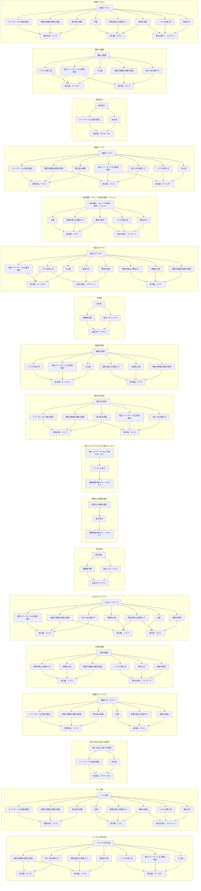

```mermaid
flowchart LR
subgraph "ティビアの呼び舟"
    N_560462760618686764["ティビアの呼び舟"]
    N_8859811435022768574["神肌の貴種＆神肌の使徒"]
    N_560462760618686764 --> N_8859811435022768574
    N_6131041789091194484["夜の霞、カリゴ"]
    N_8859811435022768574 --> N_6131041789091194484
    N_4348972186008582050["夜の魔、リブラ"]
    N_8859811435022768574 --> N_4348972186008582050
    N_3246899101195950152["冷たい谷の踊り子"]
    N_560462760618686764 --> N_3246899101195950152
    N_3246899101195950152 --> N_6131041789091194484
    N_7491262585054368236["ノクスの竜人兵"]
    N_560462760618686764 --> N_7491262585054368236
    N_8940165738753805921["夜の識、グノスター"]
    N_7491262585054368236 --> N_8940165738753805921
    N_9109677936681610561["竜のツリーガード＆王都の騎兵"]
    N_560462760618686764 --> N_9109677936681610561
    N_9109677936681610561 --> N_8940165738753805921
    N_2106832363843468584["大土竜"]
    N_560462760618686764 --> N_2106832363843468584
    N_2106832363843468584 --> N_8940165738753805921
    N_3695357517357176791["坩堝の騎士＆黄金カバ"]
    N_560462760618686764 --> N_3695357517357176791
    N_3695357517357176791 --> N_4348972186008582050
    N_3071720646317074756["死儀礼の鳥"]
    N_560462760618686764 --> N_3071720646317074756
    N_3071720646317074756 --> N_4348972186008582050
end
subgraph "ミミズ顔"
    N_5111444594145290157["ミミズ顔"]
    N_6934070734365214594["ツリーガード＆王都の騎兵"]
    N_5111444594145290157 --> N_6934070734365214594
    N_5292002518376938890["深海の夜、マリス"]
    N_6934070734365214594 --> N_5292002518376938890
    N_5196970203981399600["神肌の貴種＆神肌の使徒"]
    N_5111444594145290157 --> N_5196970203981399600
    N_5196970203981399600 --> N_5292002518376938890
    N_5677443949167871657["降る星の成獣"]
    N_5111444594145290157 --> N_5677443949167871657
    N_5677443949167871657 --> N_5292002518376938890
    N_7136387399807894468["古竜"]
    N_5111444594145290157 --> N_7136387399807894468
    N_346350579461166097["夜の爵、エデレ"]
    N_7136387399807894468 --> N_346350579461166097
    N_4358168246624603040["坩堝の騎士＆黄金カバ"]
    N_5111444594145290157 --> N_4358168246624603040
    N_4358168246624603040 --> N_346350579461166097
    N_4982969081956479702["僻地の宿将"]
    N_5111444594145290157 --> N_4982969081956479702
    N_4982969081956479702 --> N_346350579461166097
    N_189213417761207828["夜光の騎士、フルゴール"]
    N_4982969081956479702 --> N_189213417761207828
    N_3036383979227982459["ノクスの竜人兵"]
    N_5111444594145290157 --> N_3036383979227982459
    N_3036383979227982459 --> N_189213417761207828
    N_509166088155830890["無名の王"]
    N_5111444594145290157 --> N_509166088155830890
    N_509166088155830890 --> N_189213417761207828
end
subgraph "亜人の女王＆亜人の剣聖"
    N_1134453578986705362["亜人の女王＆亜人の剣聖"]
    N_4424810382238941292["ツリーガード＆王都の騎兵"]
    N_1134453578986705362 --> N_4424810382238941292
    N_5275601818925502173["夜の獣、グラディウス"]
    N_4424810382238941292 --> N_5275601818925502173
    N_7875102889532982062["忌み鬼"]
    N_1134453578986705362 --> N_7875102889532982062
    N_7875102889532982062 --> N_5275601818925502173
end
subgraph "英雄のガーゴイル"
    N_7722397118869691944["英雄のガーゴイル"]
    N_2653181689868866751["ツリーガード＆王都の騎兵"]
    N_7722397118869691944 --> N_2653181689868866751
    N_3233865160499665922["深海の夜、マリス"]
    N_2653181689868866751 --> N_3233865160499665922
    N_6919379178798614930["神肌の貴種＆神肌の使徒"]
    N_7722397118869691944 --> N_6919379178798614930
    N_6919379178798614930 --> N_3233865160499665922
    N_6591670823211023057["降る星の成獣"]
    N_7722397118869691944 --> N_6591670823211023057
    N_6591670823211023057 --> N_3233865160499665922
    N_3448049976205431385["古竜"]
    N_7722397118869691944 --> N_3448049976205431385
    N_3081067320762363000["夜の爵、エデレ"]
    N_3448049976205431385 --> N_3081067320762363000
    N_6739965407556538959["坩堝の騎士＆黄金カバ"]
    N_7722397118869691944 --> N_6739965407556538959
    N_6739965407556538959 --> N_3081067320762363000
    N_8395874466216224770["僻地の宿将"]
    N_7722397118869691944 --> N_8395874466216224770
    N_8395874466216224770 --> N_3081067320762363000
end
subgraph "王族の幽鬼"
    N_3440909751501848613["王族の幽鬼"]
    N_7637488621454797297["坩堝の騎士＆黄金カバ"]
    N_3440909751501848613 --> N_7637488621454797297
    N_2008727663320854317["夜の魔、リブラ"]
    N_7637488621454797297 --> N_2008727663320854317
    N_8908375875291676799["死儀礼の鳥"]
    N_3440909751501848613 --> N_8908375875291676799
    N_8908375875291676799 --> N_2008727663320854317
    N_8963873102615971094["神肌の貴種＆神肌の使徒"]
    N_3440909751501848613 --> N_8963873102615971094
    N_8963873102615971094 --> N_2008727663320854317
    N_7450937237240088943["ノクスの竜人兵"]
    N_3440909751501848613 --> N_7450937237240088943
    N_3050698245633808725["夜光の騎士、フルゴール"]
    N_7450937237240088943 --> N_3050698245633808725
    N_4427015217971260789["無名の王"]
    N_3440909751501848613 --> N_4427015217971260789
    N_4427015217971260789 --> N_3050698245633808725
    N_3779508150890625651["僻地の宿将"]
    N_3440909751501848613 --> N_3779508150890625651
    N_3779508150890625651 --> N_3050698245633808725
end
subgraph "公のフレイディア"
    N_56664096226504464["公のフレイディア"]
    N_1856515295308857955["竜のツリーガード＆王都の騎兵"]
    N_56664096226504464 --> N_1856515295308857955
    N_5817744364539958473["夜の霞、カリゴ"]
    N_1856515295308857955 --> N_5817744364539958473
    N_2205758757282592424["神肌の貴種＆神肌の使徒"]
    N_56664096226504464 --> N_2205758757282592424
    N_2205758757282592424 --> N_5817744364539958473
    N_190940101016292800["夜の魔、リブラ"]
    N_2205758757282592424 --> N_190940101016292800
    N_5383782577416542155["冷たい谷の踊り子"]
    N_56664096226504464 --> N_5383782577416542155
    N_5383782577416542155 --> N_5817744364539958473
    N_2299324156411773432["古竜"]
    N_56664096226504464 --> N_2299324156411773432
    N_1715206969046100865["夜の爵、エデレ"]
    N_2299324156411773432 --> N_1715206969046100865
    N_3406580750828575354["坩堝の騎士＆黄金カバ"]
    N_56664096226504464 --> N_3406580750828575354
    N_3406580750828575354 --> N_1715206969046100865
    N_3406580750828575354 --> N_190940101016292800
    N_1440167783647278596["僻地の宿将"]
    N_56664096226504464 --> N_1440167783647278596
    N_1440167783647278596 --> N_1715206969046100865
    N_4433782240185610169["死儀礼の鳥"]
    N_56664096226504464 --> N_4433782240185610169
    N_4433782240185610169 --> N_190940101016292800
end
subgraph "死の騎士"
    N_7918331692204470272["死の騎士"]
    N_7468623188558951446["神獣獅子舞"]
    N_7918331692204470272 --> N_7468623188558951446
    N_6895673816774958215["反逆のストラゲス"]
    N_7468623188558951446 --> N_6895673816774958215
    N_3258187616375770836["騎士アルトリウス"]
    N_7918331692204470272 --> N_3258187616375770836
    N_3258187616375770836 --> N_6895673816774958215
end
subgraph "呪剣士＆神獣の戦士"
    N_2550144854851432355["呪剣士＆神獣の戦士"]
    N_449418323708537913["血の君主"]
    N_2550144854851432355 --> N_449418323708537913
    N_222179501828094184["英雄武器の娘たち、ハルモニア"]
    N_449418323708537913 --> N_222179501828094184
end
subgraph "傷ついたデーモン＆うろ底のデーモン"
    N_1570498244824069935["傷ついたデーモン＆うろ底のデーモン"]
    N_1024080319564308413["デーモンの王子"]
    N_1570498244824069935 --> N_1024080319564308413
    N_3188683733850621979["英雄武器の娘たち、ハルモニア"]
    N_1024080319564308413 --> N_3188683733850621979
end
subgraph "接ぎ木の君主"
    N_4452999035111863423["接ぎ木の君主"]
    N_5509209869628460024["ツリーガード＆王都の騎兵"]
    N_4452999035111863423 --> N_5509209869628460024
    N_6749081328027477521["深海の夜、マリス"]
    N_5509209869628460024 --> N_6749081328027477521
    N_6192624815200587708["神肌の貴種＆神肌の使徒"]
    N_4452999035111863423 --> N_6192624815200587708
    N_7866013785701871978["夜の霞、カリゴ"]
    N_6192624815200587708 --> N_7866013785701871978
    N_6192624815200587708 --> N_6749081328027477521
    N_7565337607667163026["降る星の成獣"]
    N_4452999035111863423 --> N_7565337607667163026
    N_7565337607667163026 --> N_6749081328027477521
    N_8975238088526262282["竜のツリーガード＆王都の騎兵"]
    N_4452999035111863423 --> N_8975238088526262282
    N_8975238088526262282 --> N_7866013785701871978
    N_910296106138154433["冷たい谷の踊り子"]
    N_4452999035111863423 --> N_910296106138154433
    N_910296106138154433 --> N_7866013785701871978
end
subgraph "戦場の宿将"
    N_5937814991657855789["戦場の宿将"]
    N_386838289294589612["ノクスの竜人兵"]
    N_5937814991657855789 --> N_386838289294589612
    N_2060047433548054163["夜の識、グノスター"]
    N_386838289294589612 --> N_2060047433548054163
    N_8478930132293615655["竜のツリーガード＆王都の騎兵"]
    N_5937814991657855789 --> N_8478930132293615655
    N_8478930132293615655 --> N_2060047433548054163
    N_6790114088623637213["大土竜"]
    N_5937814991657855789 --> N_6790114088623637213
    N_6790114088623637213 --> N_2060047433548054163
    N_542295208657659979["坩堝の騎士＆黄金カバ"]
    N_5937814991657855789 --> N_542295208657659979
    N_5217146576651707464["夜の魔、リブラ"]
    N_542295208657659979 --> N_5217146576651707464
    N_6329006851498560561["死儀礼の鳥"]
    N_5937814991657855789 --> N_6329006851498560561
    N_6329006851498560561 --> N_5217146576651707464
    N_7729943804344023829["神肌の貴種＆神肌の使徒"]
    N_5937814991657855789 --> N_7729943804344023829
    N_7729943804344023829 --> N_5217146576651707464
end
subgraph "大赤熊"
    N_4490137731040055286["大赤熊"]
    N_6954660881176478665["神獣獅子舞"]
    N_4490137731040055286 --> N_6954660881176478665
    N_678469260156350440["反逆のストラゲス"]
    N_6954660881176478665 --> N_678469260156350440
    N_2689681330843646193["騎士アルトリウス"]
    N_4490137731040055286 --> N_2689681330843646193
    N_2689681330843646193 --> N_678469260156350440
end
subgraph "百足のデーモン"
    N_4983830594968772437["百足のデーモン"]
    N_4938154099147187882["ノクスの竜人兵"]
    N_4983830594968772437 --> N_4938154099147187882
    N_4411140200822899765["夜の識、グノスター"]
    N_4938154099147187882 --> N_4411140200822899765
    N_8851784934037186894["夜光の騎士、フルゴール"]
    N_4938154099147187882 --> N_8851784934037186894
    N_4522301035074870031["竜のツリーガード＆王都の騎兵"]
    N_4983830594968772437 --> N_4522301035074870031
    N_4522301035074870031 --> N_4411140200822899765
    N_284574590260023164["大土竜"]
    N_4983830594968772437 --> N_284574590260023164
    N_284574590260023164 --> N_4411140200822899765
    N_3014513364542068880["坩堝の騎士＆黄金カバ"]
    N_4983830594968772437 --> N_3014513364542068880
    N_5623362206517233099["夜の魔、リブラ"]
    N_3014513364542068880 --> N_5623362206517233099
    N_2408959408121730371["死儀礼の鳥"]
    N_4983830594968772437 --> N_2408959408121730371
    N_2408959408121730371 --> N_5623362206517233099
    N_4891324053783927484["神肌の貴種＆神肌の使徒"]
    N_4983830594968772437 --> N_4891324053783927484
    N_4891324053783927484 --> N_5623362206517233099
    N_9078292117649831970["無名の王"]
    N_4983830594968772437 --> N_9078292117649831970
    N_9078292117649831970 --> N_8851784934037186894
    N_6936691567389011282["僻地の宿将"]
    N_4983830594968772437 --> N_6936691567389011282
    N_6936691567389011282 --> N_8851784934037186894
end
subgraph "夜の騎兵：グレイブ＆夜の騎兵：フレイル"
    N_3847261672596407076["夜の騎兵：グレイブ＆夜の騎兵：フレイル"]
    N_7166670211719565585["古竜"]
    N_3847261672596407076 --> N_7166670211719565585
    N_7410600124255297262["夜の爵、エデレ"]
    N_7166670211719565585 --> N_7410600124255297262
    N_2780156774657744241["坩堝の騎士＆黄金カバ"]
    N_3847261672596407076 --> N_2780156774657744241
    N_2780156774657744241 --> N_7410600124255297262
    N_3384558857267228387["僻地の宿将"]
    N_3847261672596407076 --> N_3384558857267228387
    N_3384558857267228387 --> N_7410600124255297262
    N_928455525594583558["夜光の騎士、フルゴール"]
    N_3384558857267228387 --> N_928455525594583558
    N_5463202391375141796["ノクスの竜人兵"]
    N_3847261672596407076 --> N_5463202391375141796
    N_5463202391375141796 --> N_928455525594583558
    N_6547686683420241804["無名の王"]
    N_3847261672596407076 --> N_6547686683420241804
    N_6547686683420241804 --> N_928455525594583558
end
subgraph "熔鉄デーモン"
    N_7907747522057942726["熔鉄デーモン"]
    N_8863751548090275012["ツリーガード＆王都の騎兵"]
    N_7907747522057942726 --> N_8863751548090275012
    N_8415681548399171829["深海の夜、マリス"]
    N_8863751548090275012 --> N_8415681548399171829
    N_9136906684821449843["神肌の貴種＆神肌の使徒"]
    N_7907747522057942726 --> N_9136906684821449843
    N_9035043979981560469["夜の霞、カリゴ"]
    N_9136906684821449843 --> N_9035043979981560469
    N_9136906684821449843 --> N_8415681548399171829
    N_7467160475906210759["降る星の成獣"]
    N_7907747522057942726 --> N_7467160475906210759
    N_7467160475906210759 --> N_8415681548399171829
    N_310704430668306410["竜のツリーガード＆王都の騎兵"]
    N_7907747522057942726 --> N_310704430668306410
    N_5706770188289113169["夜の識、グノスター"]
    N_310704430668306410 --> N_5706770188289113169
    N_310704430668306410 --> N_9035043979981560469
    N_2820791866473777599["冷たい谷の踊り子"]
    N_7907747522057942726 --> N_2820791866473777599
    N_2820791866473777599 --> N_9035043979981560469
    N_6245590793114744980["ノクスの竜人兵"]
    N_7907747522057942726 --> N_6245590793114744980
    N_6245590793114744980 --> N_5706770188289113169
    N_870333128005284807["大土竜"]
    N_7907747522057942726 --> N_870333128005284807
    N_870333128005284807 --> N_5706770188289113169
end
subgraph "鈴玉狩り"
    N_8965164892924187246["鈴玉狩り"]
    N_7145736002001128743["ツリーガード＆王都の騎兵"]
    N_8965164892924187246 --> N_7145736002001128743
    N_480189714962859757["夜の獣、グラディウス"]
    N_7145736002001128743 --> N_480189714962859757
    N_576153977401582098["忌み鬼"]
    N_8965164892924187246 --> N_576153977401582098
    N_576153977401582098 --> N_480189714962859757
end
subgraph "爛れた樹霊"
    N_4865186530611297523["爛れた樹霊"]
    N_631442440993175421["竜のツリーガード＆王都の騎兵"]
    N_4865186530611297523 --> N_631442440993175421
    N_1716868430847425746["夜の識、グノスター"]
    N_631442440993175421 --> N_1716868430847425746
    N_3172517986474766666["夜の霞、カリゴ"]
    N_631442440993175421 --> N_3172517986474766666
    N_3970864302445071432["神肌の貴種＆神肌の使徒"]
    N_4865186530611297523 --> N_3970864302445071432
    N_3970864302445071432 --> N_3172517986474766666
    N_6718335729425470099["冷たい谷の踊り子"]
    N_4865186530611297523 --> N_6718335729425470099
    N_6718335729425470099 --> N_3172517986474766666
    N_2598789801730153131["ノクスの竜人兵"]
    N_4865186530611297523 --> N_2598789801730153131
    N_2598789801730153131 --> N_1716868430847425746
    N_887223849296479244["大土竜"]
    N_4865186530611297523 --> N_887223849296479244
    N_887223849296479244 --> N_1716868430847425746
end
subgraph "貪食ドラゴン"
    N_5779573852605168612["貪食ドラゴン"]
    N_9189222006120179852["ツリーガード＆王都の騎兵"]
    N_5779573852605168612 --> N_9189222006120179852
    N_5942854138445844678["深海の夜、マリス"]
    N_9189222006120179852 --> N_5942854138445844678
    N_8142422959547390630["神肌の貴種＆神肌の使徒"]
    N_5779573852605168612 --> N_8142422959547390630
    N_8142422959547390630 --> N_5942854138445844678
    N_1175789959952061580["降る星の成獣"]
    N_5779573852605168612 --> N_1175789959952061580
    N_1175789959952061580 --> N_5942854138445844678
    N_5108390431474035378["古竜"]
    N_5779573852605168612 --> N_5108390431474035378
    N_7487479924176637270["夜の爵、エデレ"]
    N_5108390431474035378 --> N_7487479924176637270
    N_2494717755469054397["坩堝の騎士＆黄金カバ"]
    N_5779573852605168612 --> N_2494717755469054397
    N_2494717755469054397 --> N_7487479924176637270
    N_4184355640350544020["僻地の宿将"]
    N_5779573852605168612 --> N_4184355640350544020
    N_4184355640350544020 --> N_7487479924176637270
    N_2525077867155655834["夜光の騎士、フルゴール"]
    N_4184355640350544020 --> N_2525077867155655834
    N_2223382008849438445["ノクスの竜人兵"]
    N_5779573852605168612 --> N_2223382008849438445
    N_2223382008849438445 --> N_2525077867155655834
    N_7383339863144367493["無名の王"]
    N_5779573852605168612 --> N_7383339863144367493
    N_7383339863144367493 --> N_2525077867155655834
end
```

