### ティビアの呼び舟
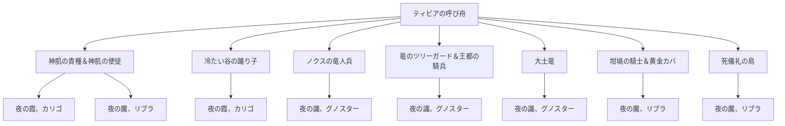

### ミミズ顔
```mermaid
flowchart TB
    N_481385238881079907["ミミズ顔"]
    N_2648219947762490956["ツリーガード＆王都の騎兵"]
    N_481385238881079907 --> N_2648219947762490956
    N_338773296671130072["深海の夜、マリス"]
    N_2648219947762490956 --> N_338773296671130072
    N_5029307592404740436["神肌の貴種＆神肌の使徒"]
    N_481385238881079907 --> N_5029307592404740436
    N_4565816654773345595["深海の夜、マリス"]
    N_5029307592404740436 --> N_4565816654773345595
    N_960298348760640593["降る星の成獣"]
    N_481385238881079907 --> N_960298348760640593
    N_2004752111931725719["深海の夜、マリス"]
    N_960298348760640593 --> N_2004752111931725719
    N_1574669762425447600["古竜"]
    N_481385238881079907 --> N_1574669762425447600
    N_8549578341250274078["夜の爵、エデレ"]
    N_1574669762425447600 --> N_8549578341250274078
    N_7591143660257666144["坩堝の騎士＆黄金カバ"]
    N_481385238881079907 --> N_7591143660257666144
    N_7647467276937688831["夜の爵、エデレ"]
    N_7591143660257666144 --> N_7647467276937688831
    N_3724599915974021746["僻地の宿将"]
    N_481385238881079907 --> N_3724599915974021746
    N_7680110372213471052["夜の爵、エデレ"]
    N_3724599915974021746 --> N_7680110372213471052
    N_3093109982815305658["夜光の騎士、フルゴール"]
    N_3724599915974021746 --> N_3093109982815305658
    N_7891791399152394050["ノクスの竜人兵"]
    N_481385238881079907 --> N_7891791399152394050
    N_2805345614919217272["夜光の騎士、フルゴール"]
    N_7891791399152394050 --> N_2805345614919217272
    N_5484976273141122508["無名の王"]
    N_481385238881079907 --> N_5484976273141122508
    N_6136919059049564899["夜光の騎士、フルゴール"]
    N_5484976273141122508 --> N_6136919059049564899
```

### 亜人の女王＆亜人の剣聖
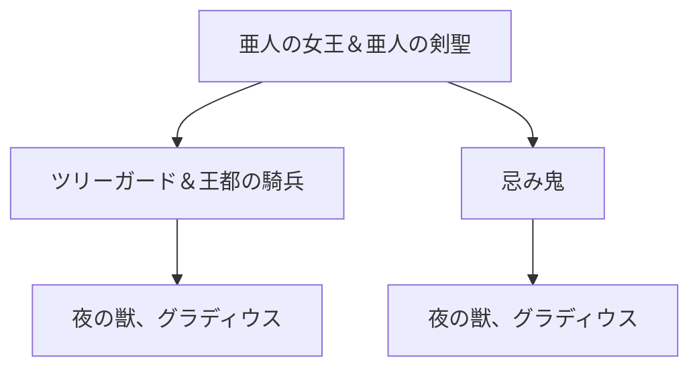

### 英雄のガーゴイル
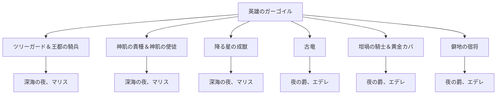

### 王族の幽鬼
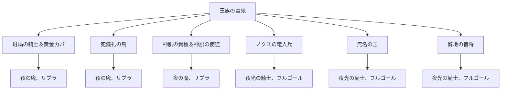

### 公のフレイディア
```mermaid
flowchart TB
    N_7965141183207122144["公のフレイディア"]
    N_1202254179501822601["竜のツリーガード＆王都の騎兵"]
    N_7965141183207122144 --> N_1202254179501822601
    N_2565555931212865051["夜の霞、カリゴ"]
    N_1202254179501822601 --> N_2565555931212865051
    N_8568660318227008180["神肌の貴種＆神肌の使徒"]
    N_7965141183207122144 --> N_8568660318227008180
    N_8960857573574215980["夜の霞、カリゴ"]
    N_8568660318227008180 --> N_8960857573574215980
    N_7117408670985623864["夜の魔、リブラ"]
    N_8568660318227008180 --> N_7117408670985623864
    N_6291085070817955687["冷たい谷の踊り子"]
    N_7965141183207122144 --> N_6291085070817955687
    N_8357254430883032696["夜の霞、カリゴ"]
    N_6291085070817955687 --> N_8357254430883032696
    N_3478485502033994660["古竜"]
    N_7965141183207122144 --> N_3478485502033994660
    N_7296188481129508317["夜の爵、エデレ"]
    N_3478485502033994660 --> N_7296188481129508317
    N_5953624565009266773["坩堝の騎士＆黄金カバ"]
    N_7965141183207122144 --> N_5953624565009266773
    N_4068064843422626232["夜の爵、エデレ"]
    N_5953624565009266773 --> N_4068064843422626232
    N_5663769618803457390["夜の魔、リブラ"]
    N_5953624565009266773 --> N_5663769618803457390
    N_4726003495029200521["僻地の宿将"]
    N_7965141183207122144 --> N_4726003495029200521
    N_2081259288540844545["夜の爵、エデレ"]
    N_4726003495029200521 --> N_2081259288540844545
    N_5676973640684827418["死儀礼の鳥"]
    N_7965141183207122144 --> N_5676973640684827418
    N_7480838506280188762["夜の魔、リブラ"]
    N_5676973640684827418 --> N_7480838506280188762
```

### 死の騎士

### 呪剣士＆神獣の戦士
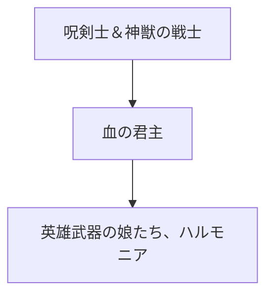

### 傷ついたデーモン＆うろ底のデーモン
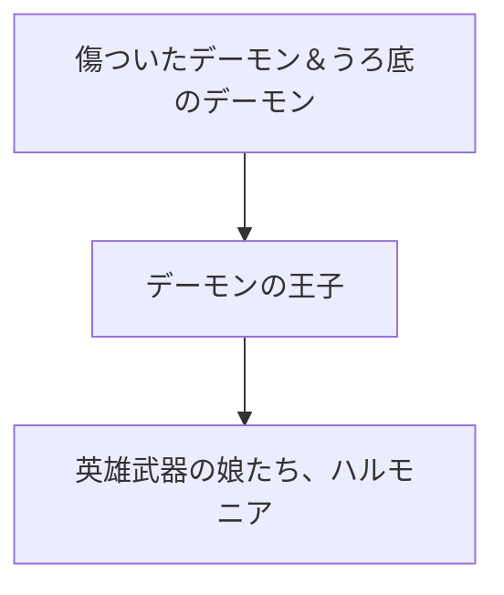

### 接ぎ木の君主
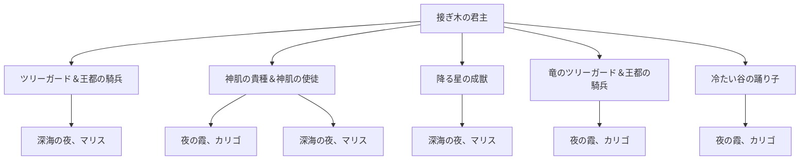

### 戦場の宿将
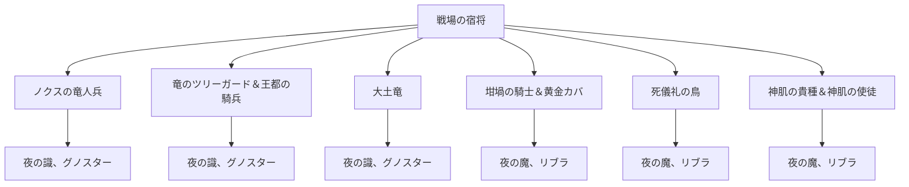

### 大赤熊
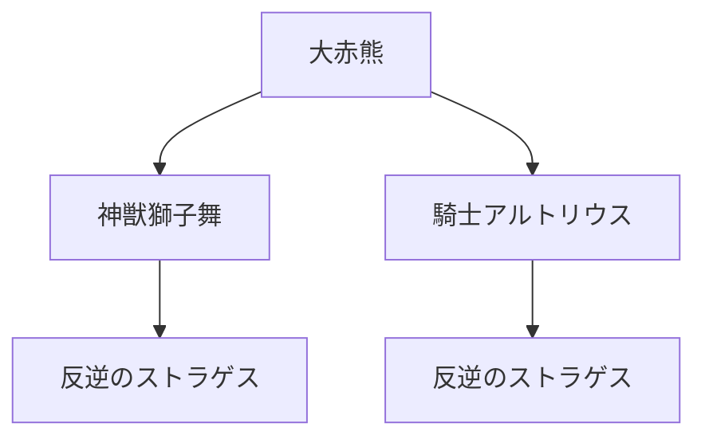

### 百足のデーモン
```mermaid
flowchart TB
    N_6095687290351112887["百足のデーモン"]
    N_6004924757311599593["ノクスの竜人兵"]
    N_6095687290351112887 --> N_6004924757311599593
    N_282146207673136325["夜の識、グノスター"]
    N_6004924757311599593 --> N_282146207673136325
    N_1914421450551456496["夜光の騎士、フルゴール"]
    N_6004924757311599593 --> N_1914421450551456496
    N_3486260151925327641["竜のツリーガード＆王都の騎兵"]
    N_6095687290351112887 --> N_3486260151925327641
    N_6270909856973102452["夜の識、グノスター"]
    N_3486260151925327641 --> N_6270909856973102452
    N_6070619726774671929["大土竜"]
    N_6095687290351112887 --> N_6070619726774671929
    N_4353939686891496270["夜の識、グノスター"]
    N_6070619726774671929 --> N_4353939686891496270
    N_8493223749289182872["坩堝の騎士＆黄金カバ"]
    N_6095687290351112887 --> N_8493223749289182872
    N_4625110764492678442["夜の魔、リブラ"]
    N_8493223749289182872 --> N_4625110764492678442
    N_1370871875660761158["死儀礼の鳥"]
    N_6095687290351112887 --> N_1370871875660761158
    N_7840858263793460025["夜の魔、リブラ"]
    N_1370871875660761158 --> N_7840858263793460025
    N_6444199846858221442["神肌の貴種＆神肌の使徒"]
    N_6095687290351112887 --> N_6444199846858221442
    N_1248601623484087379["夜の魔、リブラ"]
    N_6444199846858221442 --> N_1248601623484087379
    N_307897776497170018["無名の王"]
    N_6095687290351112887 --> N_307897776497170018
    N_1312848674489163625["夜光の騎士、フルゴール"]
    N_307897776497170018 --> N_1312848674489163625
    N_3726911113143477079["僻地の宿将"]
    N_6095687290351112887 --> N_3726911113143477079
    N_5629992767308754729["夜光の騎士、フルゴール"]
    N_3726911113143477079 --> N_5629992767308754729
```

### 夜の騎兵：グレイブ＆夜の騎兵：フレイル
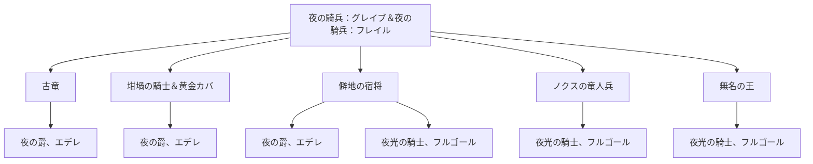

### 熔鉄デーモン
```mermaid
flowchart TB
    N_7537258131795247736["熔鉄デーモン"]
    N_4289221559034119673["ツリーガード＆王都の騎兵"]
    N_7537258131795247736 --> N_4289221559034119673
    N_6530526750199096233["深海の夜、マリス"]
    N_4289221559034119673 --> N_6530526750199096233
    N_6217528362478581442["神肌の貴種＆神肌の使徒"]
    N_7537258131795247736 --> N_6217528362478581442
    N_8553862679151541158["夜の霞、カリゴ"]
    N_6217528362478581442 --> N_8553862679151541158
    N_9178556207792273341["深海の夜、マリス"]
    N_6217528362478581442 --> N_9178556207792273341
    N_4127211833094675679["降る星の成獣"]
    N_7537258131795247736 --> N_4127211833094675679
    N_8053818418764833806["深海の夜、マリス"]
    N_4127211833094675679 --> N_8053818418764833806
    N_3450148532911785442["竜のツリーガード＆王都の騎兵"]
    N_7537258131795247736 --> N_3450148532911785442
    N_4705172387318516511["夜の識、グノスター"]
    N_3450148532911785442 --> N_4705172387318516511
    N_4503426559987857980["夜の霞、カリゴ"]
    N_3450148532911785442 --> N_4503426559987857980
    N_233460081615543638["冷たい谷の踊り子"]
    N_7537258131795247736 --> N_233460081615543638
    N_4572220830749378189["夜の霞、カリゴ"]
    N_233460081615543638 --> N_4572220830749378189
    N_3926324141249955131["ノクスの竜人兵"]
    N_7537258131795247736 --> N_3926324141249955131
    N_5413243156692150525["夜の識、グノスター"]
    N_3926324141249955131 --> N_5413243156692150525
    N_3956434572349635013["大土竜"]
    N_7537258131795247736 --> N_3956434572349635013
    N_3165225198015694178["夜の識、グノスター"]
    N_3956434572349635013 --> N_3165225198015694178
```

### 鈴玉狩り
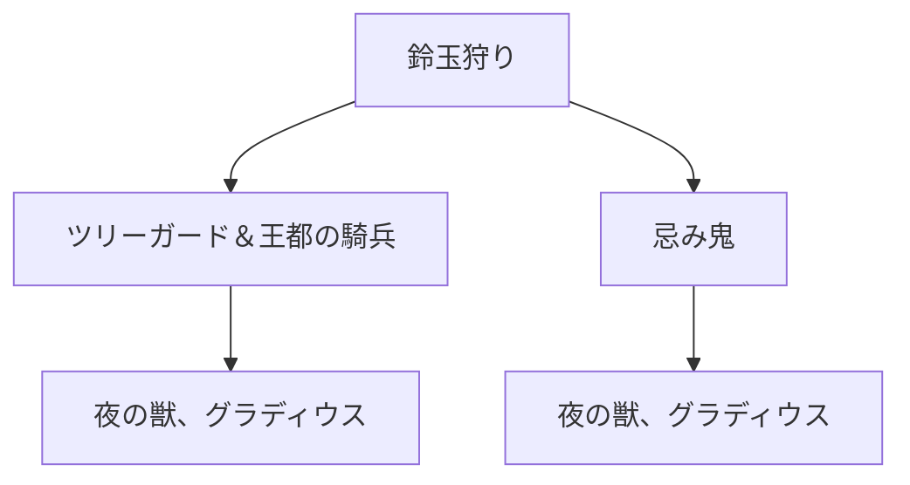

### 爛れた樹霊
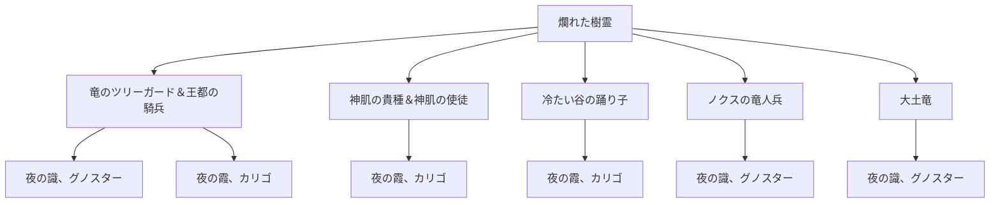

### 貪食ドラゴン
```mermaid
flowchart TB
    N_5154536259882279013["貪食ドラゴン"]
    N_7509903298323213075["ツリーガード＆王都の騎兵"]
    N_5154536259882279013 --> N_7509903298323213075
    N_7046956897447850196["深海の夜、マリス"]
    N_7509903298323213075 --> N_7046956897447850196
    N_4484027331596980347["神肌の貴種＆神肌の使徒"]
    N_5154536259882279013 --> N_4484027331596980347
    N_3310515552026381537["深海の夜、マリス"]
    N_4484027331596980347 --> N_3310515552026381537
    N_2492386652171223553["降る星の成獣"]
    N_5154536259882279013 --> N_2492386652171223553
    N_4547445966794446939["深海の夜、マリス"]
    N_2492386652171223553 --> N_4547445966794446939
    N_2893617628293132924["古竜"]
    N_5154536259882279013 --> N_2893617628293132924
    N_1062011777110111044["夜の爵、エデレ"]
    N_2893617628293132924 --> N_1062011777110111044
    N_433627407979337384["坩堝の騎士＆黄金カバ"]
    N_5154536259882279013 --> N_433627407979337384
    N_6032825896723246063["夜の爵、エデレ"]
    N_433627407979337384 --> N_6032825896723246063
    N_4224132936829456410["僻地の宿将"]
    N_5154536259882279013 --> N_4224132936829456410
    N_5744006815863926841["夜の爵、エデレ"]
    N_4224132936829456410 --> N_5744006815863926841
    N_6829270810839524642["夜光の騎士、フルゴール"]
    N_4224132936829456410 --> N_6829270810839524642
    N_618357458538145138["ノクスの竜人兵"]
    N_5154536259882279013 --> N_618357458538145138
    N_5737450183605397108["夜光の騎士、フルゴール"]
    N_618357458538145138 --> N_5737450183605397108
    N_1086555934389414139["無名の王"]
    N_5154536259882279013 --> N_1086555934389414139
    N_1669926260070029682["夜光の騎士、フルゴール"]
    N_1086555934389414139 --> N_1669926260070029682
```

